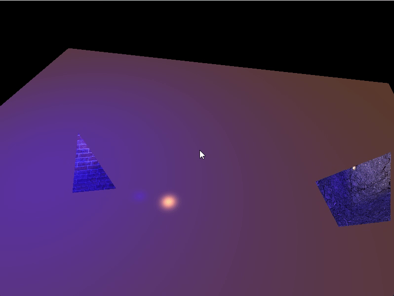

# OpenGL Rendering Engine

## Project Overview
An OpenGL-based rendering engine exploring advanced graphics concepts. This engine serves as a foundation for various simulation and visual effects projects, providing a reusable API for future creative work.

## Current Implementation Status

The engine currently supports:
- Mesh loading and rendering
- Texture mapping system
- Material properties
- Lighting:
  - Directional lights (ambient, diffuse, specular)
  - Point lights with attenuation
- Camera controls
- Shader management (vertex and fragment)
- Model, view, projection transformations

## Development Roadmap

### Lighting & Shadows
- Spotlights
- Shadow mapping:
  - Basic shadow maps
  - Cascaded shadow maps
  - Shadow optimization techniques
- Omnidirectional shadows with cubemaps

### Environment
- Skybox rendering
- Environment mapping

### Advanced Materials
- Normal mapping
- Parallax mapping & parallax occlusion mapping
- Bump mapping
- Height maps & displacement

### Advanced Rendering
- Tessellation
- Geometry shaders for procedural generation
- Compute shader integration
- 3D Gaussian Splatting (3DGS) rendering pipeline
  - Point-based rendering with Gaussian primitives
  - High-quality real-time rendering of complex scenes
- Basic ray tracing for selected effects

### Animation
- Skeletal animation with skinning weights
- Morphable models
- Dynamic mesh generation

### Optimization
- Frustum culling
- Level of detail (LOD)
- Deferred rendering pipeline

## Planned Applications
- Natural phenomena: Ocean, birds, grass, and wind simulations
- Game prototypes
- Visual effects and filters

## Next Steps
1. Implement spotlights
2. Add shadow mapping for directional lights
3. Develop skybox system
4. Implement normal mapping